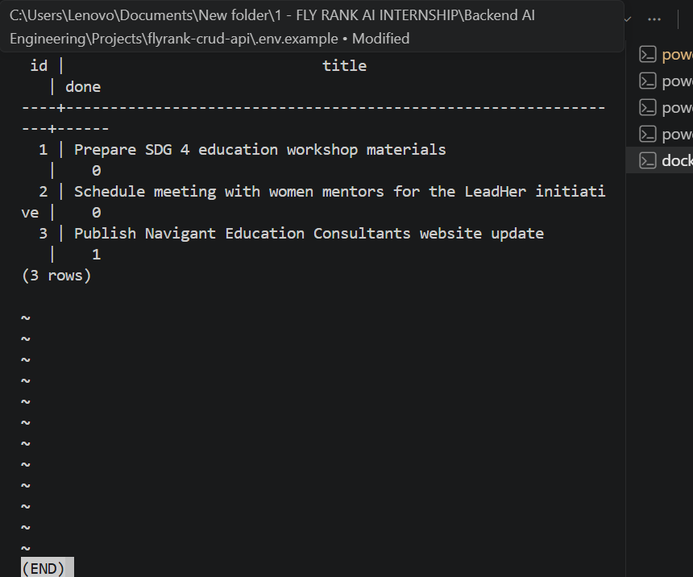
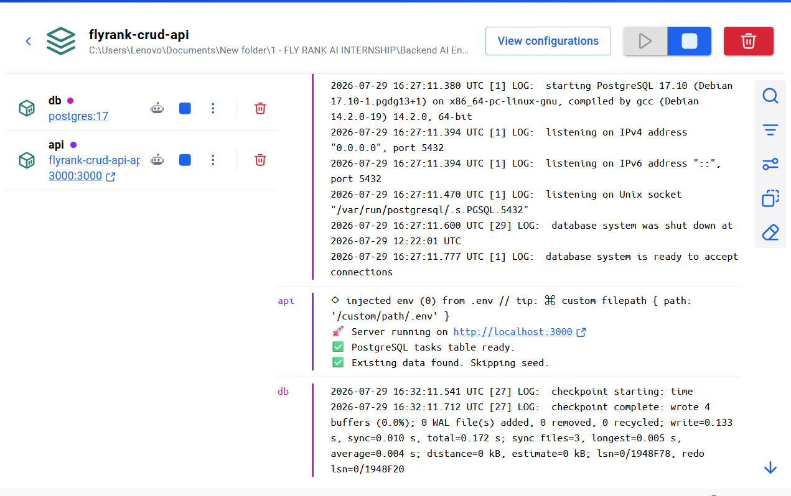
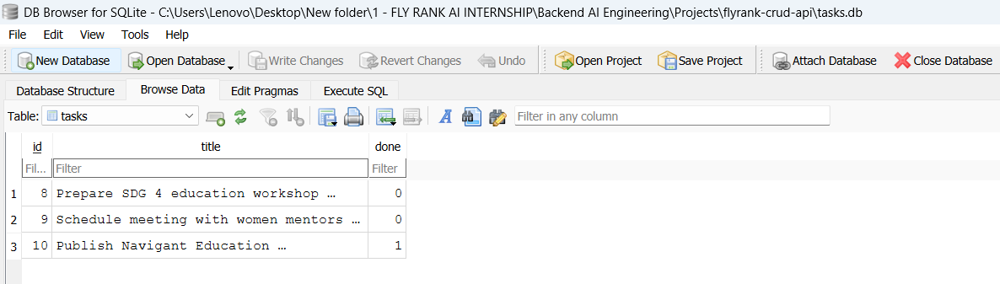

# 🚀 Navigant Education Consultants — Task Management & AI Engineering Workspace

> A continuously evolving, dual-track internship portfolio built with **Node.js, Express.js, PostgreSQL, Docker, Docker Compose, and Swagger UI**, as part of the **FlyRank AI Internship (2026)**.

This repository is maintained across **two parallel internship tracks**:

| Track | Focus | Status |
| --- | --- | --- |
| **Track 1: AI Fluency Workspace** | Prompt engineering blueprints, model benchmarking, and AI-assisted development tooling | 🟡 Scaffolded — content to be published as assignments are completed |
| **Track 2: Backend AI Engineering Workspace** | System architecture, Express.js servers, database layers, validation, containerization, and test evidence | ✅ Active — Weeks 2–6 documented below |

---

# 📖 Project Overview

This repository documents the continuous evolution of a backend application developed throughout the **FlyRank Backend AI Engineering Internship (2026)**.

The project began as a simple RESTful CRUD API and is being enhanced incrementally through weekly backend engineering assignments. Each assignment introduces new technologies, architectural improvements, and engineering practices while building upon the previous implementation.

Instead of creating separate repositories for each assignment, this project demonstrates the complete engineering journey — from a beginner-friendly CRUD API toward a more structured, containerized, and production-oriented backend application.

The application is customized with realistic operational workflows from **Navigant Education Consultants**, illustrating how backend technologies can support education, career development, and future AI-powered digital solutions aligned with:

- 🎓 **SDG 4 – Quality Education**
- 👩‍💼 **SDG 5 – Gender Equality**

This repository showcases progressive backend engineering concepts including:

- API development
- CRUD operations
- REST architecture
- OpenAPI / Swagger documentation
- Database integration and migration
- SQL and parameterized queries
- Repository-based database access
- PostgreSQL
- Environment configuration
- Docker containerization
- Docker Compose
- Persistent Docker volumes
- API testing
- Debugging and troubleshooting
- Git and GitHub workflow
- AI-assisted development and engineering comparison
- Progressive backend architecture

The repository is intentionally maintained as a **single evolving project** so that the codebase, Git history, documentation, and engineering decisions demonstrate how the application grows throughout the internship.

---

# 🧭 Track 1: AI Fluency Workspace

**Focus areas:** prompt engineering blueprints, model benchmarking, and AI-assisted development tools.

This track is being built in parallel with Track 2 and captures the AI-fluency side of the internship — how prompts are designed, how models are compared and benchmarked, and how AI tools are used responsibly inside the engineering workflow.

> **Status note:** Track 1 evidence and write-ups are currently maintained in a separate internal workspace. As each Track 1 assignment is completed and evidenced, its documentation, prompt blueprints, and benchmarking notes will be published here alongside Track 2, following the same stage-by-stage evidence format used below.

---

# ⚙️ Track 2: Backend AI Engineering Workspace

# 📋 Assignment Feature & Skills Index

| Assignment | Week | Status | Key Features Built | Skills & Tools Used |
| --- | --- | --- | --- | --- |
| **BE-01 — Build Your First CRUD API** | Week 2 | ✅ Completed | RESTful CRUD endpoints for tasks, JSON request/response handling, route parameters (`:id`), request validation, correct HTTP status codes | Node.js, Express.js, REST API design, JSON, API validation, Postman & Swagger UI testing |
| **BE-02 — Connecting CRUD API to the Database** | Week 3 | ✅ Completed | SQLite → PostgreSQL migration, PostgreSQL repository / data-access layer, automatic table initialization & seeding, parameterized queries | PostgreSQL, `pg` driver, SQL, parameterized queries, DB Browser for SQLite, repository/data-access pattern |
| **BE-04 — Containerize Your Stack** | Week 3 | ✅ Completed | Dockerized API + PostgreSQL, Docker Compose orchestration, named persistent volume, verified container-restart persistence | Docker, Dockerfile, Docker Compose, Docker volumes, environment-variable configuration |
| **Authentication — Login & Protect (BE-03)** | Week 4 | ✅ Completed | Supabase-backed signup / login / logout endpoints, JWT `access_token` / `refresh_token` issuance, reusable auth middleware, Swagger bearer-auth integration | Supabase Auth, JWT, Express middleware, OpenAPI `securitySchemes` |
| **BE-05 — The Polite Scraper** | Week 5 | ✅ Completed | Rate-limited, polite scraping pipeline, Zod-validated structured data extraction, generated PDF summary report | Node.js web scraping, Zod schema validation, PDF report generation, nested technical documentation |
| **BE-07 — Put an LLM Behind Your API** | Week 6 | ⏳ In Progress | OpenAI SDK wired through OpenRouter's free routing pathway, Stage 0 connectivity script (`src/llm/hello.js`) | OpenAI SDK, OpenRouter, Node.js module/environment debugging |

---

# 🚀 Project Evolution

This repository is maintained as a single, continuously evolving backend engineering project throughout the **FlyRank Backend AI Engineering Internship (2026)**.

Each assignment extends the existing application rather than creating a completely separate project. This approach demonstrates how the same backend evolves through progressively more advanced engineering concepts, technologies, architecture, testing, documentation, and AI integration.

| Week   | Backend AI Engineering Assignment                    | Status         |
| ------ | ----------------------------------------------------- | -------------- |
| Week 2 | BE-01 — Build Your First CRUD API                      | ✅ Completed   |
| Week 3 | BE-02 — Connecting CRUD API to the Database            | ✅ Completed   |
| Week 3 | BE-04 — Containerize Your Stack                        | ✅ Completed   |
| Week 4 | Authentication — Login & Protect                       | ✅ Completed   |
| Week 5 | The Polite Scraper                                     | ✅ Completed   |
| Week 6 | Your First Background Job                              | ⏳ Planned     |
| Week 6 | Connect to an AI API                                   | ⏳ In Progress |
| Week 7 | Build an AI Decision Flow with React Flow + Inngest     | ⏳ Planned     |
| Week 7 | PDF Report Generator                                    | ⏳ Planned     |
| Week 7 | Your first background job                               | ⏳ Planned     |
| Week 8 | Backend Capstone Documentation & Case Study             | ⏳ Planned     |

> **10-Week Internship Roadmap:** The internship is a 10-week learning journey. This table records the backend assignments currently identified in the project roadmap and is updated progressively as each assignment is completed. Future assignments and milestones will be added to the repository as the internship progresses.

# Continuous Engineering Approach

Rather than treating each assignment as an isolated exercise, this repository preserves the application's engineering history across the internship.

The project progressively demonstrates:

**CRUD API → Database Integration → PostgreSQL → Repository/Data Access → Docker → Persistent Containers → Authentication → AI Integration → Background Processing → AI Workflows → Reporting → Capstone Engineering**

This continuous evolution allows the repository to demonstrate not only individual technologies, but also the ability to **extend, refactor, test, document, and improve an existing backend system as new engineering requirements are introduced.**

---

# 🏆 Engineering Skills Progression

Throughout this internship, this repository demonstrates progressive backend engineering experience across API development, databases, containerization, testing, documentation, version control, and AI-assisted engineering.

# ✅ Completed Skills

- ✅ REST API Design
- ✅ CRUD Operations
- ✅ Express.js
- ✅ Node.js Backend Development
- ✅ OpenAPI / Swagger Documentation
- ✅ JSON Request & Response Handling
- ✅ Route Parameters
- ✅ API Validation
- ✅ HTTP Status Codes
- ✅ API Testing with Postman
- ✅ Swagger UI Testing
- ✅ Browser-based API Testing
- ✅ API Debugging & Troubleshooting
- ✅ SQL and Parameterized Queries
- ✅ SQLite Database Integration
- ✅ PostgreSQL Database Integration
- ✅ PostgreSQL Repository / Data Access Layer
- ✅ Environment Variables
- ✅ `.env` / `.env.example`
- ✅ Docker
- ✅ Dockerfile
- ✅ Docker Compose
- ✅ Docker Volumes
- ✅ Containerized PostgreSQL
- ✅ Containerized Node.js / Express API
- ✅ Persistent Data Across Container Restarts
- ✅ Git Version Control
- ✅ GitHub Repository Management
- ✅ AI-Assisted Development
- ✅ AI vs Me Implementation Comparison

# ⏳ Upcoming Skills

As the internship progresses, the same project will be extended to develop additional backend and AI engineering capabilities, including:

- ⏳ Authentication & Authorization
- ⏳ AI API Integration
- ⏳ Web Scraping
- ⏳ Background Jobs
- ⏳ AI Workflow Orchestration
- ⏳ PDF Generation
- ⏳ Production Deployment
- ⏳ Additional backend engineering practices introduced through later internship assignments

> **Progressive Engineering Principle:** Skills are marked as completed only when they have been implemented and verified within the project. Future capabilities remain marked as upcoming until the corresponding internship work is completed and evidenced.

---

# ✨ Features

# Current Features

# 🌐 API & Backend

- ✅ RESTful CRUD API
- ✅ Node.js backend
- ✅ Express.js server
- ✅ JSON request and response handling
- ✅ Route parameters (`:id`)
- ✅ CRUD operations for tasks
- ✅ Request validation
- ✅ Appropriate HTTP status codes
- ✅ API debugging and troubleshooting

# 🗄 Database & Persistence

- ✅ SQLite database integration during the initial database stage
- ✅ PostgreSQL relational database integration
- ✅ PostgreSQL repository / data-access layer
- ✅ SQL queries
- ✅ Parameterized SQL queries
- ✅ Automatic PostgreSQL table initialization
- ✅ Automatic default task seeding
- ✅ Seeding only when the database is empty
- ✅ Persistent PostgreSQL storage
- ✅ PostgreSQL data preserved across container restarts

# 🐳 Docker & Infrastructure

- ✅ Dockerized Node.js / Express API
- ✅ Dockerized PostgreSQL database
- ✅ Dockerfile
- ✅ Docker Compose
- ✅ API + PostgreSQL launched together with `docker compose up`
- ✅ Named Docker volume for PostgreSQL persistence
- ✅ Containerized development environment
- ✅ Verified application and database container startup
- ✅ Verified database persistence after stack restart

# 🔐 Configuration & Security

- ✅ Environment-variable based configuration
- ✅ `.env` for local configuration
- ✅ `.env.example` configuration template
- ✅ `.env` excluded from version control
- ✅ Database credentials kept outside committed source code

# 📚 API Documentation & Testing

- ✅ OpenAPI 3.0 specification
- ✅ Interactive Swagger UI documentation
- ✅ Postman API testing
- ✅ Swagger UI (`Try it out`) testing
- ✅ Browser testing for GET requests
- ✅ CRUD endpoint verification
- ✅ PostgreSQL persistence verification

# 🧰 Engineering Workflow

- ✅ Git version control
- ✅ GitHub repository management
- ✅ Incremental Git commits
- ✅ README documentation
- ✅ Evidence-based development documentation
- ✅ AI-assisted development
- ✅ AI vs Me implementation comparison
- ✅ Engineering decisions evaluated against an independent AI implementation

# 🎓 Real-World Project Context

- ✅ Realistic Navigant Education Consultants task data
- ✅ Educational and community-oriented workflow examples
- ✅ Project evolution documented as part of the FlyRank Backend AI Engineering Internship
- ✅ Single continuously evolving repository rather than isolated assignment repositories

---

# 🛠 Technology Stack

| Technology | Purpose |
| --- | --- |
| **Node.js** | JavaScript runtime for the backend application |
| **Express.js** | Backend web framework for building the REST API |
| **JavaScript** | Primary programming language |
| **REST API** | Backend API architecture and communication style |
| **JSON** | Request and response data format |
| **Swagger UI** | Interactive API documentation and endpoint testing |
| **OpenAPI 3.0** | API specification and documentation |
| **Postman** | API endpoint testing and verification |
| **SQLite** | Initial persistent database used during the earlier database integration stage |
| **sqlite3** | Node.js SQLite driver used during the earlier database implementation |
| **DB Browser for SQLite** | Database inspection and SQL testing during the earlier SQLite stage |
| **PostgreSQL** | Current relational database used for persistent application data |
| **`pg`** | Node.js PostgreSQL client/driver |
| **SQL** | Database querying and data manipulation |
| **Parameterized SQL Queries** | Safer database query execution and input handling |
| **Repository / Data Access Layer** | Separates database operations from the application/API layer |
| **dotenv** | Loads environment variables from `.env` |
| **`.env`** | Local database and application configuration |
| **`.env.example`** | Safe configuration template for project setup |
| **Docker** | Containerizes the backend application and database environment |
| **Dockerfile** | Defines the container image for the Node.js API |
| **Docker Compose** | Orchestrates the API and PostgreSQL services together |
| **Docker Volume** | Provides persistent PostgreSQL data storage across container restarts |
| **Git** | Source-code version control |
| **GitHub** | Remote repository and project history |
| **VS Code** | Development environment |
| **AI Assistant / ChatGPT** | AI-assisted learning, development support, debugging, comparison, and engineering reflection |

---

# 🧩 BE-01 — Build Your First CRUD API *(Week 2)*

# 🔗 API Endpoints

The Task Management API exposes RESTful CRUD endpoints for creating, reading, updating, and deleting task records stored in PostgreSQL.

| Method   | Endpoint     | Description                          | Success Response |
|----------|--------------|---------------------------------------|-------------------|
| `GET`    | `/tasks`     | Retrieve all tasks                    | `200 OK`          |
| `GET`    | `/tasks/:id` | Retrieve a specific task              | `200 OK`          |
| `POST`   | `/tasks`     | Create a new task                     | `201 Created`     |
| `PUT`    | `/tasks/:id` | Update an existing task               | `200 OK`          |
| `DELETE` | `/tasks/:id` | Delete an existing task               | `204 No Content`  |
| `GET`    | `/docs`      | Interactive Swagger UI documentation  | `200 OK`          |

# Validation & Error Responses

The API also handles common invalid requests and missing resources:

| Scenario                          | Response          |
|------------------------------------|--------------------|
| Missing task title on `POST`       | `400 Bad Request`  |
| Requested task does not exist      | `404 Not Found`    |
| Unknown task ID during `PUT`       | `404 Not Found`    |
| Unknown task ID during `DELETE`    | `404 Not Found`    |

# API Base URL

When the Dockerized application is running:

```text
http://localhost:3000
```

# Example Endpoints

```text
GET    http://localhost:3000/tasks
GET    http://localhost:3000/tasks/1
POST   http://localhost:3000/tasks
PUT    http://localhost:3000/tasks/1
DELETE http://localhost:3000/tasks/1
```

# API Documentation

Interactive Swagger UI is available at:

```text
http://localhost:3000/docs
```

The OpenAPI specification is maintained in:

```text
openapi.json
```

The API can be tested through **Postman**, **Swagger UI (`Try it out`)**, and browser GET requests.

---

# 🗄️ BE-02 — Connecting CRUD API to the Database *(Week 3)*

# Database Evolution

This project demonstrates the evolution of the application's data layer during the **FlyRank Backend AI Engineering Internship (2026)**.

The application initially used **SQLite** as a lightweight persistent database during the early database integration stage. It was later migrated to **PostgreSQL** as the project progressed toward a more realistic, containerized backend architecture.

This progression demonstrates an important backend engineering principle: the application can evolve from a simple local database implementation toward a client-server relational database without changing the core purpose of the API.

# Phase 1 — SQLite

SQLite was used during the initial database integration stage because it is lightweight, serverless, easy to configure, and well suited to learning relational database concepts in a local development environment.

The SQLite implementation demonstrated:

- Persistent relational data storage
- Automatic database creation
- Automatic table creation
- Default task seeding
- SQL queries
- Parameterized queries
- CRUD operations
- Database persistence across application restarts
- Database inspection using DB Browser for SQLite

The earlier SQLite database was stored locally as:

```text
flyrank-crud-api/
└── tasks.db
```

**SQLite Initialization**

During the SQLite stage, the application automatically:

- Created `tasks.db` if it did not exist.
- Created the `tasks` table if it did not exist.
- Seeded three default tasks when the table was empty.

# Phase 2 — PostgreSQL

As the project progressed, SQLite was replaced by **PostgreSQL** to introduce a more realistic client-server relational database architecture and prepare the application for containerized development.

The current application uses:

- PostgreSQL as the persistent relational database
- Node.js `pg` driver for database communication
- Parameterized SQL queries
- A PostgreSQL repository / data-access layer
- Environment-based database configuration
- Dockerized PostgreSQL
- A persistent Docker volume

The PostgreSQL database runs as a separate Docker service from the Node.js API.

**Current Architecture**

```text
Client
   │
   ▼
Node.js / Express API
   │
   ▼
PostgreSQL Repository / Data Access Layer
   │
   ▼
PostgreSQL Database
   │
   ▼
Persistent Docker Volume
```

This separation allows the API application and database to run independently while communicating through the database connection configured through environment variables.

**PostgreSQL Initialization**

When the containerized application starts:

- PostgreSQL runs as a Docker service.
- The API connects to PostgreSQL using environment-based configuration.
- The application's `tasks` table is initialized when required.
- Default Navigant Education Consultants tasks are seeded when the database is empty.
- Existing database records are preserved when the stack is restarted.

The current PostgreSQL setup uses a Docker volume so database data is stored independently of the lifecycle of the PostgreSQL container.

**Why PostgreSQL Replaced SQLite**

The migration from SQLite to PostgreSQL was part of the project's progression from a learning-focused local database toward a more realistic backend architecture.

PostgreSQL provides a dedicated database server architecture that better represents the type of relational database environment commonly used in production backend systems.

The migration also introduced practical experience with:

- Database connection configuration
- PostgreSQL drivers
- Repository / data-access patterns
- Dockerized databases
- Docker Compose
- Persistent Docker volumes
- Environment variables
- Database service connectivity
- Application and database lifecycle management

**Database Persistence**

Persistence was verified using the Dockerized PostgreSQL database.

The verification process involved:

1. Creating task records.
2. Running the API and PostgreSQL through Docker Compose.
3. Stopping the application and database containers.
4. Starting the stack again.
5. Querying PostgreSQL to confirm that previously stored records remained available.

This demonstrated that the data was persisted through the Docker volume rather than being lost when the containers were stopped or recreated.

**Engineering Lesson**

The database evolution demonstrates that backend architecture is not static.

The project progressed from:

```text
SQLite
   ↓
PostgreSQL
   ↓
Dockerized PostgreSQL
   ↓
Persistent PostgreSQL storage
```

This progression provided practical experience in replacing a local database implementation with a more production-oriented database while preserving the application's core CRUD functionality.

# 🧪 Example SQL Query

SQL was used throughout the database stages of the project to inspect, verify, and work with task records.

**Current PostgreSQL Query**

The current application uses PostgreSQL as its persistent database.

The following query was used to inspect the records stored in the `tasks` table:

```sql
SELECT * FROM tasks;
```

The query can be executed through PostgreSQL using:

```bash
docker exec -it flyrank-crud-api-db-1 psql -U postgres -d tasks -c "SELECT * FROM tasks;"
```

This was used to verify that task records existed in the PostgreSQL database and remained available after restarting the Dockerized application stack.

**Example Result**

The PostgreSQL database was successfully queried and returned persisted task records, including realistic Navigant Education Consultants workflow data.

Example:

```text
 id |                             title                              | done
----+-----------------------------------------------------------------+------
  1 | Prepare SDG 4 education workshop materials                     |   0
  2 | Schedule meeting with women mentors for the LeadHer initiative |   0
  3 | Publish Navigant Education Consultants website update          |   1
```

This provided direct evidence that the API was connected to PostgreSQL and that the database contained persistent application data.

**Earlier SQLite Stage**

During the earlier SQLite database stage, the same SQL concept was tested using DB Browser for SQLite:

```sql
SELECT * FROM tasks;
```

This allowed the database records to be inspected directly while learning database persistence and SQL operations.

The project therefore demonstrates the same core database operation across two stages:

```text
SQLite
   ↓
SQL Query
   ↓
PostgreSQL
   ↓
SQL Query
```

The database technology changed as the architecture evolved, while the core task-management data model and CRUD purpose remained consistent.

# 📸 Database Screenshot

The current application uses **PostgreSQL** as its persistent database and runs PostgreSQL inside Docker.

Database verification was performed by querying the running PostgreSQL container and confirming that task records were stored successfully.

The database verification evidence is maintained in the project's Notion documentation.

**PostgreSQL Database Evidence**

**PostgreSQL Tasks Data**



**Dockerized PostgreSQL + API**



The verification demonstrated:

- ✅ PostgreSQL container running successfully
- ✅ `tasks` table available
- ✅ Task records stored in PostgreSQL
- ✅ Realistic Navigant Education Consultants task data present
- ✅ Data remained available after restarting the Dockerized stack
- ✅ PostgreSQL persistence provided through the Docker volume

Example verification query:

```sql
SELECT * FROM tasks;
```

The project also retains evidence from the earlier SQLite stage, where **DB Browser for SQLite** was used to inspect and verify the database before the migration to PostgreSQL.

> **Evidence:** Database screenshots and terminal verification outputs are documented in the project's Notion knowledge base.

**Earlier SQLite Stage**

The project previously used SQLite during BE-02. The following screenshot documents that earlier database stage before the migration to PostgreSQL.



---

# 🐳 BE-04 — Containerize Your Stack *(Week 3)*

# 📂 Project Structure

```text
flyrank-crud-api/
│
├── .gitignore
├── .env.example
├── README.md
├── Dockerfile
├── compose.yaml
├── server.js
├── database.js
├── openapi.json
├── package.json
├── package-lock.json
└── tasks.db
```

**Key Files**

| File | Purpose |
| --- | --- |
| `server.js` | Main Node.js / Express application and API routes |
| `database.js` | PostgreSQL database connection, table initialization, seeding, and database access logic |
| `openapi.json` | OpenAPI 3.0 specification for the REST API |
| `Dockerfile` | Defines the Docker image for the Node.js API |
| `compose.yaml` | Defines and orchestrates the API and PostgreSQL services |
| `.env.example` | Safe template showing required environment configuration without real credentials |
| `.gitignore` | Prevents local files and sensitive configuration such as `.env` from being committed |
| `README.md` | Project documentation, setup instructions, architecture notes, and engineering progression |
| `package.json` | Project metadata, dependencies, and npm scripts |
| `package-lock.json` | Locks the installed dependency versions |
| `tasks.db` | Earlier SQLite database file from the previous database stage |

**Current Runtime Architecture**

The current application runs as two Docker Compose services:

```text
Docker Compose
│
├── API Container
│   └── Node.js + Express
│       └── server.js
│
└── Database Container
    └── PostgreSQL
        └── Persistent Docker Volume
```

The earlier `tasks.db` file is retained in the repository as part of the project's database migration history. **PostgreSQL is the current database used by the running application.**

# 🚀 Getting Started

**Prerequisites**

Make sure the following are installed:

- Node.js
- Docker Desktop
- Git

You do **not** need to install PostgreSQL separately because the current application runs PostgreSQL inside Docker.

**Clone Repository**

```bash
git clone https://github.com/SyedaMun/flyrank-crud-api.git
cd flyrank-crud-api
```

**Install Dependencies**

Install the Node.js dependencies defined in `package.json`:

```bash
npm install
```

This installs the packages required by the API for local development and ensures that the project's dependency versions are installed according to `package-lock.json`.

> **Note:** The current Docker workflow also installs the application dependencies inside the API container when the image is built.

**Configure Environment Variables**

Create a local `.env` file in the project root using `.env.example` as the template.

The `.env.example` file documents the required configuration without exposing real credentials.

Example:

```text
DATABASE_URL=your_postgresql_connection_string
PORT=3000
```

> **Security:** `.env` is intentionally excluded from Git through `.gitignore`. Never commit real database credentials, passwords, or other secrets to the repository.

**Start the Full Stack**

The current application is containerized with Docker Compose.

Start the API and PostgreSQL database together with:

```bash
docker compose up
```

Docker Compose starts:

- Node.js / Express API
- PostgreSQL database
- Persistent PostgreSQL Docker volume

The API will be available at:

```text
http://localhost:3000
```

**API**

Task endpoints are available under:

```text
http://localhost:3000/tasks
```

**Swagger Documentation**

Interactive API documentation is available at:

```text
http://localhost:3000/docs
```

**Run in Detached Mode**

To start the stack in the background:

```bash
docker compose up -d
```

You can verify the running services with:

```bash
docker compose ps
```

The expected services are:

- API container
- PostgreSQL database container

**Stop the Stack**

To stop the containers:

```bash
docker compose down
```

> The PostgreSQL data remains available because the database uses a persistent Docker volume. Stopping the containers does not remove the volume.

**Verify PostgreSQL Data**

The PostgreSQL database can be queried from inside the running database container:

```bash
docker exec -it flyrank-crud-api-db-1 psql -U postgres -d tasks -c "SELECT * FROM tasks;"
```

This can be used to verify that task records exist in the current PostgreSQL database.

**Persistence Verification**

To verify persistence:

1. Start the stack with `docker compose up`.
2. Create task records through the API.
3. Stop the stack with `docker compose down`.
4. Start the stack again with `docker compose up -d`.
5. Verify the containers are running with `docker compose ps`.
6. Query PostgreSQL and confirm that the previously created records remain.

This demonstrates that PostgreSQL data persists through application and container restarts because it is stored in the Docker volume.

---

# 🔐 Authentication — Login & Protect (BE-03) *(Week 4)*

# Authentication Infrastructure (Week 4 / BE-03 Update)

The Task Management Engine features a modular token-based authentication subsystem leveraging the Supabase identity platform layer. Secure endpoints are guarded utilizing custom interceptive route middleware patterns.

**Expanded Security Features**

- **User Provisioning Gateway (`POST /auth/signup`):** Handles input format checking and routes records into encrypted offsite database tables.
- **Cryptographic Token Dispatch Desk (`POST /auth/login`):** Authorizes user identity details and issues standard JWT `access_token` and `refresh_token` envelopes.
- **Session Deactivation Gate (`POST /auth/logout`):** Destroys active validation strings globally across cloud registries.
- **Decoupled Verification Middleware (`authenticateUser`):** A reusable Express interceptor function that dynamically extracts bearer strings from request headers and parses validation states securely.
- **Interactive Lock Integration:** OpenAPI spec configurations extended via `securitySchemes` to implement interactive lock controls across the Swagger UI browser dashboard layer.

---

# 🕸️ BE-05 — The Polite Scraper *(Week 5)*

A rate-limited, "polite" scraping pipeline was built on top of the existing backend to collect and structure book-catalog data end-to-end — from raw HTML collection through to a finished report artifact.

**Key features built:**

- A staged Stage 0 → Stage 6 scraping roadmap (check-before-you-collect, listing collection, detail-page extraction, cleaning/validation & storage, failure survival & reporting, and evidence publication)
- Zod structural schemas enforcing strict data-typing across every scraped item
- A generated PDF summary report of the scraped catalog data
- A nested `scraper/README.md` documenting the pipeline architecture and evidence

**Skills & tools used:** Node.js-based web scraping, Zod schema validation, PDF report generation, resilient/rate-limited request handling, and structured technical documentation.

> Full stage-by-stage evidence (screenshots, logs, and milestone checkpoints) for BE-05 is maintained in the project's Notion knowledge base.

---

# 🤖 AI Engine Integration (Week 6 / BE-07 Update)

**BE-07 — Put an LLM Behind Your API** is currently in progress, bringing the first live LLM connectivity into the backend stack.

**Progress so far:**

- ✅ Connected the **OpenAI SDK** to the backend, routed through **OpenRouter's free routing pathway**, so the API can reach hosted LLMs without a paid direct provider key.
- ✅ Resolved early integration blockers, including terminal **line-ending inconsistencies** and **module resolution bugs**, that were preventing the SDK from initializing cleanly.
- ✅ Verified the **Stage 0 connectivity test script** (`src/llm/hello.js`), which now runs successfully end-to-end and outputs `ready`, confirming the API can reach the LLM provider before any application logic is layered on top.

**Skills & tools used:** OpenAI SDK, OpenRouter free routing, Node.js environment/module debugging, connectivity smoke-testing.

**Next steps:** build the request/response handling layer on top of this Stage 0 connection, then extend into background job processing and the AI decision-flow work planned for Weeks 6–7.

---

# 🧪 Testing

The project has been tested progressively throughout the internship as new backend capabilities were introduced.

# API Testing

The REST API was tested using:

- ✅ Postman
- ✅ Swagger UI (`Try it out`)
- ✅ Browser testing for GET requests

The CRUD operations were verified for:

- `GET /tasks`
- `GET /tasks/:id`
- `POST /tasks`
- `PUT /tasks/:id`
- `DELETE /tasks/:id`

# Validation & Error Testing

The API was also tested against invalid and missing data, including:

- Missing task title
- Non-existent task IDs
- Invalid update requests
- Invalid delete requests

Expected HTTP responses were verified, including:

- `400 Bad Request`
- `404 Not Found`
- `201 Created`
- `200 OK`
- `204 No Content`

# Database Testing

Database behavior was verified during both the SQLite and PostgreSQL stages.

**SQLite Stage**

The earlier SQLite implementation was tested using:

- DB Browser for SQLite
- SQL queries
- Application restarts
- CRUD operations

**PostgreSQL Stage**

The current PostgreSQL implementation was verified using:

- PostgreSQL running inside Docker
- Docker Compose
- PostgreSQL SQL queries
- `docker exec`
- Application logs
- Database container logs

Example verification query:

```sql
SELECT * FROM tasks;
```

### Docker Testing

The containerized stack was verified using:

```bash
docker compose up
```

and:

```bash
docker compose up -d
```

Running services were verified with:

```bash
docker compose ps
```

The expected architecture was confirmed:

```text
Docker Compose
│
├── API Container
│   └── Node.js + Express
│
└── Database Container
    └── PostgreSQL
```

# Persistence Testing

Database persistence was explicitly tested by:

1. Creating task records.
2. Confirming the records in PostgreSQL.
3. Stopping the application and database containers.
4. Starting the stack again.
5. Querying PostgreSQL after restart.
6. Confirming that the previously stored records remained available.

This verified that the PostgreSQL Docker volume was providing persistent storage rather than temporary container storage.

# Configuration Testing

Environment configuration was verified using:

- `.env`
- `.env.example`
- `.gitignore`

The actual `.env` file remains local and is not committed to GitHub.

# AI-Assisted Testing & Comparison

During Stage 6, the implemented solution was also compared with an independently generated AI implementation.

The comparison examined areas including:

- Architecture
- Database handling
- Docker configuration
- Environment configuration
- Repository/data-access design
- Error handling
- Code organization
- Documentation
- Engineering trade-offs

The purpose was not simply to determine which implementation was "better", but to evaluate the differences and use AI as an engineering review and learning tool.

# Testing Evidence

Testing evidence is documented in the project's Notion knowledge base and includes relevant screenshots, terminal outputs, database verification, Docker status, Git status, and AI-assisted engineering comparison evidence.

---

# 🎯 Learning Outcomes

Through the progressive development of this project during the **FlyRank Backend AI Engineering Internship (2026)**, I have developed practical experience in the following areas:

### Backend Engineering

- Backend application setup and project organization
- Node.js runtime fundamentals
- Express.js backend development
- REST API architecture
- CRUD operations
- HTTP methods and status codes
- Route parameters
- JSON request and response handling
- Input validation
- API error handling
- API debugging and troubleshooting

# Database Engineering

- Relational database concepts
- SQL queries
- Parameterized SQL queries
- SQLite database integration
- PostgreSQL database integration
- Database initialization and table creation
- Data seeding
- Repository / data-access layer concepts
- Persistent data storage
- Database verification and inspection
- Migration from a lightweight local database to PostgreSQL

# Docker & Infrastructure

- Docker fundamentals
- Writing a Dockerfile
- Containerizing a Node.js API
- Running PostgreSQL in Docker
- Docker Compose
- Multi-container application architecture
- Docker networking between services
- Docker volumes
- Persistent database storage
- Starting and managing a complete backend stack with one command
- Verifying application and database containers

# API Documentation & Testing

- OpenAPI 3.0
- Swagger UI
- Postman API testing
- Browser-based API testing
- CRUD endpoint verification
- Database persistence verification
- Testing expected error responses
- Evidence-based technical documentation

# Configuration & Security

- Environment variables
- `.env` configuration
- `.env.example` templates
- `.gitignore`
- Keeping local credentials outside the public repository
- Understanding the difference between configuration and source code

# Version Control & Professional Workflow

- Git version control
- Git staging and commits
- Meaningful commit messages
- GitHub repository management
- Git push / pull workflow
- Maintaining a clean working tree
- Incremental project development
- README documentation
- Portfolio-oriented project organization

# AI-Assisted Engineering

- Using AI as a development and learning assistant
- Breaking backend tasks into smaller engineering stages
- Using AI for debugging and troubleshooting
- Comparing an independently implemented solution with an AI-generated solution
- Evaluating AI-generated architecture and implementation choices
- Identifying differences, strengths, weaknesses, and trade-offs
- Improving prompts based on implementation results
- Using AI to support engineering reasoning rather than simply copying generated code

# Engineering Mindset

The most important outcome of this project is learning how to **evolve an existing backend system rather than repeatedly building isolated examples**.

The project demonstrates a progression from:

```text
REST API
   ↓
Persistent Database
   ↓
PostgreSQL
   ↓
Repository / Data Access
   ↓
Dockerized Application
   ↓
Dockerized PostgreSQL
   ↓
Persistent Containerized Stack
   ↓
AI-Assisted Engineering Review
```

This experience has strengthened my understanding of how backend components work together and how engineering decisions affect maintainability, persistence, portability, testing, and future scalability.

> **Learning principle:** The objective of this internship is not only to complete assignments, but to understand the concepts behind each implementation and build a portfolio that demonstrates practical engineering reasoning.

---

# 👩‍💻 Author

**Syeda Munazza Bukhari**

Founder — Navigant Education Consultants

Backend AI Engineering Intern — FlyRank AI Internship (2026)

Building practical backend and AI engineering solutions that support education, career development, and digital empowerment.

GitHub: [SyedaMun](https://github.com/SyedaMun)

---

# 🙏 Acknowledgements

Developed as part of the **FlyRank Backend AI Engineering Internship (2026)** to strengthen practical backend engineering skills through hands-on project development.
